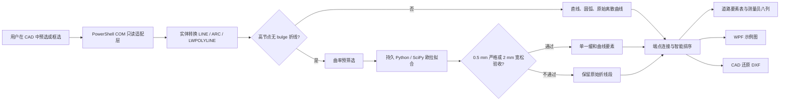

# RoadCurveImporter 技术手册

**文档版本：** 1.1  
**适用正式版本：** `RoadCurveImporter.ps1`（SHA-256：`4FA051A122FFCF911F058C64F99C525C24E70C3189C18FA88AF8E9CA60702932`，2026-08-25 已发布）  
**维护目标：** 在不改写、保存或关闭 CAD 图形的前提下，从当前 CAD 会话读取道路要素，识别欧拉回旋线，生成测量员八列 Excel、交互式示意图和 CAD 还原 DXF。

> **安全边界。** 本工具对 CAD 仅做自动化读取：不调用保存、修改、删除、关闭图形的接口。AutoCAD 只读取用户预选集；SouthMap/ZWCAD 可使用临时选择集，且必须在 `finally` 中删除。

---

## 1. 最终交付组成

| 文件 | 用途 | 是否运行时必需 |
|---|---|---|
| `RoadCurveImporter.ps1` | PowerShell 7 + WPF 主程序。 | 是 |
| `RoadCurveImporter.config.json` | 端点连接、宽松回旋线验收和 Excel 小数位配置。 | 是 |
| `spiral_fitter.py` | SciPy 欧拉回旋线拟合器（`least_squares`）。 | 是；仅高节点回旋线识别时调用 |
| `spiral_fitter_server.py` | 持久 Python 拟合服务端；一个导入批次只初始化一次 SciPy。 | 是；仅高节点回旋线识别时调用 |
| `dxf_writer.py` | 基于 `ezdxf` 的 AC1015/R2000 标准 DXF 写出器。 | 是；所有 DXF 导出均调用它 |
| `high_vertex_polyline_inspection.json` | 16 条复杂高节点回旋线回归数据（含真实图纸数据，未随仓库发布）。 | 否 |
| `tests/` | 开发期 DXF 回归与结构对比脚本。 | 否；维护测试 |

运行环境为 **Windows + PowerShell 7 + WPF**。高节点欧拉回旋线识别还需要本机 `python` 命令以及 `numpy`、`scipy`、`ezdxf`。如果 Python 或 SciPy 不可用，程序不会崩溃；该类高节点折线将按原始直线段保真输入，并在诊断框中说明原因。

---

## 2. 总体架构与数据流



内部 CAD 几何一律使用笛卡尔坐标：**X 为东、Y 为北，数学航向角以东为 0、逆时针为正**。测量员导出使用测绘方位角：**北为 0、顺时针为正**。坐标显示交换和曲线方向反向均为展示/导出语义，不能污染内部 CAD 原始几何。

---

## 3. CAD 适配和只读规则

### 3.1 主机适配

| 主机 | 接入策略 | 安全限制 |
|---|---|---|
| SouthMap / ZWCAD | 通过 COM 自动化连接；可创建临时选择集并调用 `SelectOnScreen()`。 | 临时选择集必须在 `finally` 删除；不调用保存/关闭。 |
| Autodesk AutoCAD | 枚举多版本 COM 入口；仅读取 `PickfirstSelectionSet`。 | 禁止再次调用 `SelectOnScreen()`，避免抢占用户选择和导致 CAD 卡死。 |
| 模型空间读取 | 枚举 `ModelSpace`，按图层过滤。 | 只读取 `LayerOn=True`、未 `Freeze`、未 `VPFreeze` 的图层。 |

### 3.2 支持的实体

`Test-SupportedRoadEntity` 只允许 `LINE`、`ARC`、`LWPOLYLINE/Polyline`。普通直线和圆弧直接转换；带 bulge 的多段线会逐段拆解为直线/圆弧；无 bulge 的高节点折线先尝试欧拉回旋线识别，否则按原始直线段保留。椭圆弧、样条及其离散化结果不会被冒充为欧拉回旋线。

> 修改 CAD 读取逻辑时，必须保留 `Run-Import` 中的 `try/finally` 清理、AutoCAD 预选保护和可见图层过滤。任何写入 CAD 的 COM 调用均不应加入本项目。

---

## 4. 道路要素模型与排序

每个内部线元均为 `PSCustomObject`，核心字段包括 `Kind`、`Start`、`End`、`Length`、`StartHeading`、`EndHeading`、`StartRadius`、`EndRadius`、`Vertices`、`IsGapFill` 和 `Note`。`Publish-Elements` 将排序后的内部线元转换成主表行，并同时构造测量员预览行。

### 4.1 连接与填充

`RoadCurveImporter.config.json` 控制 `endpointConnectionToleranceMm`，正式默认值为 **1.0 mm**。当相邻端点距离小于配置容差时，排序器认为它们可以连接：

| 间隙范围 | 处理方式 |
|---|---|
| `< 0.1 mm` | 直接连接；不增加虚拟线元。 |
| `0.1 mm ≤ 间隙 ≤ 配置容差` | 插入 `IsGapFill=True` 的填充直线，示意图显示为橙色虚线，诊断及备注可追溯。 |
| `> 配置容差` | 不强行连接；从下一个连通分量继续排序。 |

`MinGapFillM = 0.0001` 是实现这一规则的唯一阈值；更改它前必须同步更新配置说明、回归自测和本手册。

### 4.2 线路方向

导入后根据端点连接质量选择更符合 CAD 原始实体方向的排序方向。用户可使用“一键换向”，它会反转线元顺序、起终点、方位角和曲线左右语义；曲线方向反向复选框则只改变测量/显示语义。无论哪一种显示选项均不能改变 DXF 的原始 CAD 还原方向。

---

## 5. 欧拉回旋线识别与拟合

### 5.1 当前支持范围

自动合并只针对 **欧拉回旋线（clothoid）**。高节点无 bulge 折线必须同时满足：未闭合、顶点数不少于 20、顶点数不超过 `MaxSpiralFitVertices`（正式值 600），并且曲率—弧长预筛选可接受。其他曲线仍按原始折线处理。

### 5.2 曲率预筛选

对连续弦段计算累计弧长和局部转角/曲率后，进行线性回归。回归斜率必须使用：

\[
\text{slope}=\frac{n\sum xy-\sum x\sum y}{n\sum x^2-(\sum x)^2}
\]

其中 `x` 是累计弧长，`y` 是局部曲率。历史缺陷曾误把分子末项写为 `sumX × sumX`；修改本段代码时不得回退为该错误形式。预筛选同时检查曲率符号单一、拟合优度和曲率跨度，严格模式不通过则不会启动 Python 拟合；宽松模式会记录诊断后继续尝试。

### 5.3 严格与宽松验收

| 模式 | 最大原始顶点拟合残差 | 用户界面 | 配置方式 |
|---|---:|---|---|
| 严格 | **0.5 mm** | 固定灰色只读 | 代码固定，不能通过配置放宽或收紧 |
| 宽松 | **2.0 mm**（默认） | 灰色只读 | 修改 JSON 的 `looseSpiralFitToleranceMm` 后重启 |
| 关闭 | 不拟合 | 取消“识别缓和曲线” | 高节点折线按原始直线段导入 |

0.5 mm 是对 CAD 地理坐标常见显示精度的工程验收，不应与八列端点正算误差混淆。复杂图回归中的 16 条候选在严格模式下全部通过，最大顶点残差为 **0.017485 mm**。

### 5.4 持久拟合服务

`Invoke-EulerFit` 会先调用 `Start-SpiralFitServer` 启动：

```text
python -u spiral_fitter_server.py spiral_fitter.py
```

PowerShell 通过标准输入输出传输一行 JSON：`points` 和 `tolerance_m`。同一个导入批次重复使用该进程，以避免为每条曲线重复加载 SciPy；批次结束时 `Run-Import` 的 `finally` 调用 `Stop-SpiralFitServer` 清理进程。每条拟合限时 5 秒，候选数量上限为 24，超限/超时/失败均应保留原始折线而非丢弃。

---

## 6. WPF 示意图维护

### 6.1 绘制入口

`Draw-Schematic` 在下列场景被调用：导入完成后的 `Reset-PreviewZoom`、坐标显示选项变化、曲线方向变化、一键换向、画布尺寸变化、缩放和拖拽。`PreviewCanvas` 中的配色规则如下。

| 要素 | 颜色/样式 |
|---|---|
| 直线 | 青绿色 |
| 圆曲线 | 红褐色 |
| 缓和曲线/原始离散曲线 | 蓝紫色 |
| 端点填充直线 | 深橙色虚线 |
| 起点 / 终点 | 绿色 / 红色标识 |

### 6.2 已修复的空白图原因

边界计算原先通过嵌套函数 `Add-PreviewBound` 修改 `$minX`、`$maxX` 等变量。PowerShell 嵌套函数内的赋值落在子作用域，外层变量保持 `Infinity`，使 `Draw-Schematic` 直接返回，画布因而为空。

当前实现先将起点、终点、圆心和顶点收集到 `previewBounds`，再在 `Draw-Schematic` 本作用域内归约最小/最大坐标。**今后不要把边界变量的赋值再移入普通嵌套函数。** 如果必须封装，应显式使用 `$script:`、引用参数或返回计算结果。

### 6.3 性能保护

当线元数超过 `MaxPreviewElementShapes`（1600）时，程序不为每一个线元创建 WPF 图形，而是按间隔抽样绘制概览并显示性能诊断。高节点曲线的可视顶点也受 `MaxPreviewVerticesPerCurve`（900）约束。该保护只影响示意图，不影响表格、拟合、Excel 或 DXF。

---

## 7. 测量员表格与 Excel

Excel 导出固定为 **无表头八列**：

| 列序 | 字段 |
|---:|---|
| 1 | 起始里程 |
| 2 | 结束里程 |
| 3 | 起始 X |
| 4 | 起始 Y |
| 5 | 起始方位角（`dd.mmss`） |
| 6 | 开始半径（左负、右正） |
| 7 | 结束半径（左负、右正） |
| 8 | `0` |

应用内“测量员格式预览”增加线型和灰色的终点核验列，但 Excel 仍严格输出八列。方位角通过 `Get-SurveyorDmsNumber` 统一转换为数值 `dd.mmss`；例如 `46.911323°` 输出为 `46.544076`。

“CAD 坐标 XY 交换”默认勾选，**只交换主表、测量员预览和 Excel 的坐标显示顺序**。示意图内部几何、DXF 坐标和 DXF 方向均不得因它而镜像或交换。

---

## 8. CAD 还原 DXF 与拟合折线

### 8.1 坐标与图层约定

`Export-Dxf` 不使用测量表的显示控制，而是始终取内部 CAD 原始笛卡尔坐标和原始曲线方向。

| 内部线元 | DXF 实体 | 图层 |
|---|---|---|
| 直线 | `LINE` | `ROAD_CURVE` |
| 端点填充 | `LINE` | `ROAD_GAP_FILL` |
| 圆曲线 | `ARC` | `ROAD_CURVE` |
| 已识别欧拉回旋线 | `LWPOLYLINE` | `ROAD_SPIRAL_POLYLINE` |
| 非欧拉离散曲线 | `LWPOLYLINE` | `ROAD_DISCRETE_POLYLINE` |

### 8.2 为什么必须按拟合模型生成

标准 DXF 没有欧拉回旋线实体。过去的手写 PowerShell DXF 缺少可由不同 CAD 严格解释的完整对象表、句柄与实体编码，因此可能被 SouthMap/ZWCAD 视为损坏。现行 `Export-Dxf` 将 JSON 载荷交给同目录 `dxf_writer.py`，由 `ezdxf` 写出完整 **AC1015/R2000** 容器。欧拉回旋线继续由 `Get-SpiralDxfVertices` 根据已验收的拟合参数生成开放 `LWPOLYLINE`，不复用源折线的粗弦。

写出器将缓和曲线固定写到 `ROAD_SPIRAL_POLYLINE`，并显式保留 `AcDbEntity`、`AcDbPolyline`、`90` 顶点数、开放标志、`10/20/30` XYZ 顶点组以及颜色、真彩色、线型、线宽和比例属性。DXF 始终取 CAD 原始 X/Y 与原方向；XY 交换和曲线反向仅影响表格/预览，不参与 DXF 写出。

模型为：

\[
\theta(s)=\theta_0+k_0s+\frac{1}{2}\frac{k_1-k_0}{L}s^2
\]

其中 `L` 为曲线长，`k0` 和 `k1` 为开始、结束曲率。程序以中点积分推进坐标，最大采样段长为 **0.25 m**，单条曲线最多 2000 段。最后将拟合端点与 CAD 源端点的小残差按弧长比例平滑分配，使首末端点保持原 CAD 坐标，且不会把最后一个折线段拉长。

复杂图验收结果为 16 条 `ROAD_SPIRAL_POLYLINE`，每条 801–802 个顶点，最大相邻段长 `0.250000001 m`（双精度序列化量级误差），首末端点与 CAD 原值一致。

> 修改 `maximumSegmentM` 时，应同时调整 `test_complex_spiral_fitted_dxf.ps1` 的顶点数/段长断言，并考虑 DXF 文件体积与 CAD 打开性能。

---

## 9. 配置文件

正式配置示例：

```json
{
  "endpointConnectionToleranceMm": 1.0,
  "looseSpiralFitToleranceMm": 2.0,
  "surveyorExportDigits": 6
}
```

| 键 | 有效范围 | 含义 |
|---|---:|---|
| `endpointConnectionToleranceMm` | `(0, 1000]` | 相邻要素允许连接的平面距离，单位 mm。 |
| `looseSpiralFitToleranceMm` | `[0.1, 10]` | 宽松欧拉回旋线最大顶点拟合残差，单位 mm。 |
| `surveyorExportDigits` | `[6, 12]` | 八列 Excel 的小数位数。 |

程序启动时读取 JSON；修改后需重启。严格 0.5 mm 不写入配置，避免误认为用户可修改。使用“恢复默认值”会原子重写 JSON，并清除当前导入数据，但不会修改 CAD。

---

## 10. 回归测试清单

所有脚本均在项目目录中运行。执行前请关闭或不要操作 CAD，因为这些自测不会写 CAD，但可能连接当前会话读取其可见实体；复杂图专项回归只读取本地 JSON，不需要 CAD。

| 命令 | 验证目标 | 关键通过条件 |
|---|---|---|
| `pwsh -NoProfile -Sta -File .\RoadCurveImporter.ps1 -LayoutSelfTest` | 响应式布局 | `LAYOUT_SELFTEST_OK`。 |
| `pwsh -NoProfile -Sta -File .\RoadCurveImporter.ps1 -DxfCadRestoreSelfTest` | 原始 CAD 坐标、圆弧与拟合 DXF | 输出 `FittedLWPOLYLINE(161 vertices)`。 |
| `python .\validate_dxf_ezdxf.py .\selftest_cad_restore.dxf` | 标准解析器独立验证 | `valid=true`、AC1015、开放 LWPOLYLINE 与 `ROAD_SPIRAL_POLYLINE`。 |
| `pwsh -NoProfile -Sta -File .\tests\test_complex_spiral_fitted_dxf.ps1 -CandidatePath .\RoadCurveImporter.ps1` | 拟合 DXF | 16 条折线、801–802 顶点、最大段长 ≤ 0.25 m（需自备 `high_vertex_polyline_inspection.json`）。 |
| `pwsh -NoProfile -Sta -File .\RoadCurveImporter.ps1 -SelfTest` | 基本读取、填充线、DXF | 输出 `SELFTEST_OK` 与 `GAP_FILL_SELFTEST_OK`。 |

建议发布前至少执行：解析检查、`-DxfCadRestoreSelfTest`、复杂示意图回归、复杂拟合 DXF 回归。不要仅依据脚本可解析就发布。

---

## 11. 常见故障排查

| 现象 | 首先检查 | 处理建议 |
|---|---|---|
| 导入器闪退或报错 | `RoadCurveImporter.runtime.log` | 查看阶段、CAD 实体数和道路段数；不要反复盲目重试。 |
| 读取模型空间很慢 | 当前可见图层和实体数量 | 关闭无关图层，或使用框选；保持候选线元安全上限。 |
| 高节点曲线未识别 | 诊断框、Python/SciPy、严格/宽松模式 | 先确认无 bulge、未闭合、顶点数量范围；检查 `spiral_fitter.py` 与服务器文件是否齐全。 |
| 示意图空白 | `Draw-Schematic`、画布尺寸、`PreviewCanvas.Children.Count` | 检查边界归约是否仍在主作用域；运行 `RoadCurveImporter.ps1 -LayoutSelfTest` 检查界面。 |
| DXF 中无缓和曲线 | DXF 完成提示、`ROAD_SPIRAL_POLYLINE` 图层 | 先确认源线元已识别为“缓和曲线”，再运行 `tests\test_complex_spiral_fitted_dxf.ps1`。 |
| DXF 图形方向/坐标异常 | 显示选项使用位置 | DXF 不应读取 `SwapCadXY` 或 `ReverseCurveDirection`；检查 `Export-Dxf`。 |
| 表格与 Excel 角度不一致 | `Get-SurveyorValues` | 必须统一走 `Get-SurveyorDmsNumber(To-SurveyAzimuth(...))`。 |

---

## 12. 发布、回退与扩展规范

### 12.1 安全发布步骤

1. 不直接覆盖正式脚本；先复制 `RoadCurveImporter.ps1` 为带时间戳的 `before_*` 备份。
2. 在同目录生成候选文件，并使用 `[System.Management.Automation.Language.Parser]::ParseFile()` 解析。
3. 运行第 10 节所列的核心回归，特别是复杂示意图和拟合 DXF。
4. 将候选复制到 `RoadCurveImporter.ps1.next`，用本机 `Move-Item` 或 `[System.IO.File]::Move(..., overwrite)` 原子替换正式文件。
5. 生成或更新发布清单，记录 SHA-256、备份路径、关键阈值与测试结论。
6. 仅重启导入器 `pwsh.exe` 进程，绝不结束 CAD 进程；用 `check_process_windows.ps1` 确认“道路曲线要素导入器”窗口可见。

### 12.2 回退步骤

当前标准 DXF 发布的首选回退点为：

```text
RoadCurveImporter.ps1.before_ezdxf_20260825_080232.bak
```

原子替换过程还生成了 `RoadCurveImporter.ps1.atomic_replace_20260825_080305.bak`。二者的 SHA-256 均为发布前正式版 `B55A8DD5FC094F61705F9B5E3FDAAE10BEC8645B0730FE8EDB99D6AB225E7BE7`。

如需回退，先关闭导入器窗口，再在 PowerShell 中执行：

```powershell
Copy-Item .\RoadCurveImporter.ps1.before_preview_dxf_fix_20260824_221821 .\RoadCurveImporter.ps1 -Force
```

回退后重新启动导入器，并至少运行 `-DxfCadRestoreSelfTest`。配置与 Python 拟合器在本次“示意图 + 拟合 DXF”发布中未变更；若回退到地理精度版本之前，请同时参考该历史版本的发布记录（未随仓库发布）。

### 12.3 修改守则

| 修改类别 | 必须同步检查 |
|---|---|
| WPF 控件、布局或事件 | `Update-ResponsiveLayout`、`Draw-Schematic`、1280×720/宽屏布局自测、表格内部滚动。 |
| 坐标/方位角/半径语义 | 主表、测量员预览、八列 Excel、反算脚本、DXF 原始坐标独立性。 |
| 欧拉拟合器或阈值 | 曲率预筛选公式、持久服务协议、16 条复杂回归、严格/宽松文案和配置说明。 |
| DXF 代码 | 不得让显示 XY 交换或曲线方向选项影响 DXF；检查 `ROAD_SPIRAL_POLYLINE` 数量、顶点数、端点和最大段长。 |
| CAD COM 代码 | 只读安全边界、AutoCAD 预选集保护、ZWCAD 选择集清理、可见图层过滤、异常日志。 |

---

## 13. 本地参考文件

本手册中的实现结论和验收数据可直接在以下项目文件中复查：

- [正式主脚本](./RoadCurveImporter.ps1)
- [正式配置](./RoadCurveImporter.config.json)
- [欧拉拟合器](./spiral_fitter.py)
- [持久拟合服务端](./spiral_fitter_server.py)
- [标准 DXF 写出器](./dxf_writer.py)
- [标准 DXF 独立验证器](./validate_dxf_ezdxf.py)
- [复杂图拟合 DXF 回归脚本](./tests/test_complex_spiral_fitted_dxf.ps1)（需自备 `high_vertex_polyline_inspection.json`）
- [隔离 DXF 打开测试](./tests/test_dxf_open_isolated.ps1)
- [真实 SouthMap/ZWCAD 验收记录](./real_cad_visual_acceptance_20260825.md)

这些文件组成可复现的维护基线。后续功能修改应先从正式脚本复制候选文件，完成专项回归后再进行原子发布。


---

## 14. 现场可靠性修复记录（2026-08-24）

本次修复由当前打开的 **SouthMap/ZWCAD 2026** 会话和 `Drawing4.dwg` 现场验证。以下三项属于维护时不可回退的基线。

| 问题 | 根因 | 当前修复 | 验证方式 |
|---|---|---|---|
| 界面始终显示“未检测到所选 CAD 会话” | `Update-HostStatus` 使用 `$host` 作为局部变量；PowerShell 变量名大小写不敏感，`$Host` 是只读内置变量，因此赋值立即抛错并进入 `catch`。 | 改用 `$cadHost`。底层 COM 连接逻辑未变。 | `test_current_cad_connection.ps1`；当前会话显示 `SouthMap/ZWCAD · 2026 · Drawing4.dwg`。 |
| 大量无序框选或“读取当前显示图层”后线元顺序混乱 | 原实现超过 300 段就完全跳过全局拓扑排序，直接使用 CAD 枚举/选择集顺序；该顺序不代表线路顺序。 | `Order-LargeElementsSpatial` 使用端点空间桶索引，按 3×3 邻桶查找邻接端点并连续走线。 | `test_large_unordered_topology.ps1`：400 条随机顺序、随机方向线元恢复为连续链，最大相邻间隙 0。 |
| ZWCAD 中 DXF 的缓和曲线看似缺失 | 旧 `LWPOLYLINE` 只有图层、顶点和标志，缺少 R2000+ DXF 的 `AcDbEntity` / `AcDbPolyline` 子类记录；ZWCAD 对这类简化实体可能不渲染。 | 文件头写入 `AC1015`，`LWPOLYLINE` 写入 `100/AcDbEntity`、图层、`100/AcDbPolyline`、顶点数、标志和恒定宽度。回旋线仍按欧拉拟合模型 0.25 m 加密采样。 | 当前 `Drawing4.dwg` 只读导入：5 要素中识别 3 条缓和曲线；诊断 DXF 含 3 条 `ROAD_SPIRAL_POLYLINE`，分别为 234、151、202 顶点。 |

### 14.1 当前图形的排序结论

现场读取 `Drawing4.dwg` 的 5 个实体后得到连续链：**缓和曲线 527 → 圆弧 52A → 缓和曲线 528 → 圆弧 52B → 缓和曲线 529**。每个相邻端点在双精度下相接；截图中的绿色起点和红色终点分别是整条开放链的首末端，位置在平面上相近并不代表排序跳段。

对一般情况仍需区分：少于等于 300 段时原有逐段拓扑搜索会连接端点；超过 300 段时必须使用新的空间索引路径。分叉线路不存在唯一“正确”主线，程序会选择距当前端点最近且输入序号稳定的候选，并在诊断面板提示分叉次数；如需指定支路，应分开选择或在导入后人工调整。

### 14.2 DXF 现场核验方法

导出完成后，诊断信息必须报告“缓和曲线已转换为 *n* 条 LWPOLYLINE”。若仍无法在 CAD 中看到曲线，请先确认打开的是**最新保存路径**，再在 CAD 中检查图层 `ROAD_SPIRAL_POLYLINE` 是否开启/未冻结。可在 PowerShell 只读检查文件：

```powershell
Select-String -Path .\道路曲线要素_CAD还原.dxf -Pattern 'ROAD_SPIRAL_POLYLINE'
```

现场发现 `道路曲线要素1.dxf` 是早期旧文件，没有 `ROAD_SPIRAL_POLYLINE` 图层记录；而本次导出的 `道路曲线要素_CAD还原.dxf` 已包含 3 条该图层实体。不要用旧文件判断当前版本的导出结果。

### 14.3 本次回退点

本次发布前备份为：

```text
RoadCurveImporter.ps1.before_field_reliability_20260824_224714
```

对应历史发布清单未随仓库发布。若需回退，按第 12 节步骤恢复该备份；回退会重新出现当前已修复的 CAD 状态、超 300 段排序和 ZWCAD DXF 兼容性问题，因此仅用于紧急比较。

---

## 15. 标准 DXF 写出器发布记录（2026-08-25）

正式版已在真实 SouthMap/ZWCAD 2026 中完成实物验收。用户从 CAD 软件内部手动打开 `selftest_complex_spirals_ezdxf_candidate.dxf` 后，SouthMap 已建立对应文档；非激活窗口抓取显示候选图层表完整，且 `ROAD_SPIRAL_POLYLINE` 处于可见状态并呈现拟合折线局部。此前的离线回归同时确认该测试文件含 **16 条**拟合缓和曲线、每条 801–802 顶点、最大段长 `0.250000001 m`。

发布采用 NTFS `File.Replace` 原子替换。发布后正式脚本的 `-DxfCadRestoreSelfTest` 与独立 `ezdxf` 验证再次通过，输出 1 条 LINE、1 条 ARC 和 1 条 161 顶点拟合开放 LWPOLYLINE。发布不会关闭、保存、修改或重启任何 CAD 图纸；如现有导入器窗口在发布前已经启动，需由用户关闭后重新运行，才会加载新脚本。


---

## 16. SouthMap/ZWCAD 冷启动文件关联（最终固定状态，2026-08-25）

SouthMap OEM 安装的原始 `ZWCAD.DXF.2026` / `ZWCAD.Drawing.2026` 关联会直接调用 `ZwLauncher.exe`。该启动器可以向**已经运行**的 CAD 会话转交文件，却不能稳定完成 OEM 主程序的首个会话初始化；因此会出现“CAD 未运行时双击图纸无窗口，先打开 CAD 后图纸才一并加载”的历史问题。

最终方案不再覆盖厂商 ProgID，改为使用 Windows 当前用户的 **UserChoice 独立 ProgID**。经 Windows `AssocQueryString` 解析和用户真实资源管理器双击共同验收，当前有效链路为：

```text
.dwg / .dxf
  → RoadCurveImporter.SouthMapColdOpen.DWG / .DXF（UserChoice）
  → C:\Windows\System32\wscript.exe
  → SouthMapColdOpen.vbs
  → SouthMapColdOpen.ps1
  → 官方 StartCAD.exe（仅冷启动）
  → 原厂 ZwLauncher.exe（文件转交）
```

冷启动包装器仅在没有 `ZWCAD.exe` 时调用厂商 `StartCAD.exe`，等待空白 `Drawing1.dwg` 就绪 5 秒后再调用原厂 `ZwLauncher.exe`；若文档窗口未出现，会在受控时间窗内最多重试 5 次。CAD 已运行时，它直接调用原厂 `ZwLauncher.exe`，不改变热启动的文件转交语义。实际资源管理器双击已由用户确认成功。

| 文件 | 作用 | 固定要求 |
|---|---|---|
| `SouthMapColdOpen.vbs` | Unicode 安全的 WScript 桥接器 | 必须与下一项位于同一项目目录。 |
| `SouthMapColdOpen.ps1` | 冷启动等待与原厂启动器转交逻辑 | 不要移动、改名或删除；UserChoice 关联按绝对路径调用。 |
| `install_independent_southmap_cold_open_userchoice.ps1` | 使用自定义 ProgID 与 UserChoice 安装关联 | 仅维护/重新部署时使用。 |
| `rollback_independent_southmap_cold_open_userchoice.ps1` | 恢复首次安装前扩展名关联 | 回滚前必须关闭 SouthMap/ZWCAD。 |
| `PS-SFTA_1.2.0_local_sid_patch.ps1` | UserChoice 哈希设置器（含本机 SID 兼容补丁） | 仅安装关联时需要；安装脚本内置该文件 SHA-256 校验。 |

> **固定要求。** 不要移动项目目录，也不要清理上表的桥接/关联文件；否则 Windows 仍会保留关联但找不到启动器。若将项目迁移到其他位置，必须在新目录运行安装脚本，并保留旧目录直到新的资源管理器双击验证通过。

当前 UserChoice 关联由安装脚本写入并校验。如果将来需恢复厂商原始行为，请在关闭 SouthMap/ZWCAD 后执行：

```powershell
pwsh -NoProfile -ExecutionPolicy Bypass -File ".\rollback_independent_southmap_cold_open_userchoice.ps1"
```

关联哈希写入由 [PS-SFTA](https://github.com/DanysysTeam/PS-SFTA) 的 MIT 授权算法实现支持；项目保留仅替换 SID 获取方式的本地兼容补丁，避免当前环境中的目录服务查询阻塞。
